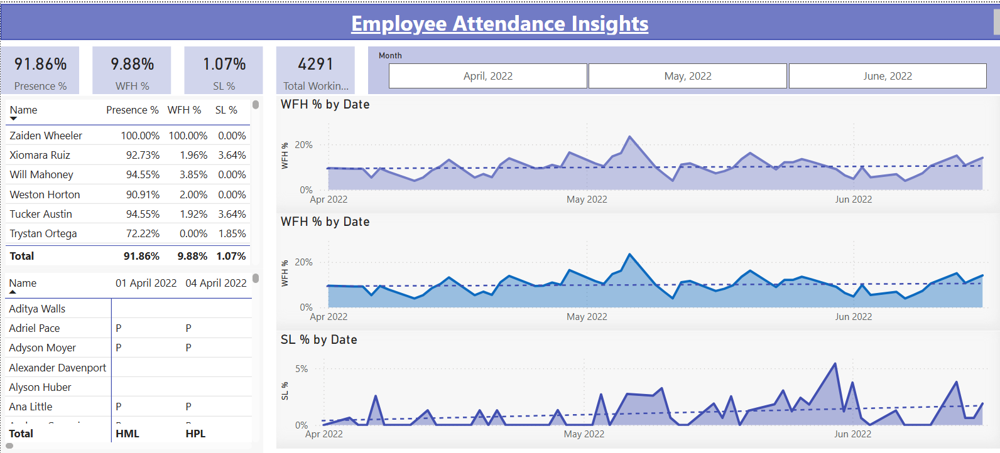

# Employee Attendance Insights – Power BI Dashboard

## 📊 Project Overview  
This Power BI dashboard provides an in-depth analysis of employee attendance trends.  
It tracks key metrics such as **Presence %**, **Work From Home (WFH) %**, and **Sick Leave (SL) %** across months, enabling HR teams and managers to monitor workforce patterns and make informed decisions.

---

## ✨ Key Insights  
- Overall Presence %, WFH %, and SL % for the selected time period  
- Monthly trends for WFH and SL percentages  
- Employee-level breakdown for attendance metrics  
- Automatic calculation of **Total Working Days** excluding weekends and holidays  
- Interactive month filter to explore data by period

---

## 🛠 Tools & Technologies  
- **Power BI Desktop** – for data modeling, DAX measures, and dashboard creation  
- **DAX (Data Analysis Expressions)** – to calculate Presence %, WFH %, SL %, and working days  
- **Excel/CSV** – as the source dataset  

---

## 📌 DAX Measures Used  
Custom DAX calculations were created for:  
- Presence %  
- Present Days (counting “P” + WFH)  
- WFH % and WFH Count  
- SL % and SL Count  
- Total Working Days (excluding WO/HO)  

> Full DAX formulas can be viewed in the `.pbix` file.

---

## 📂 Repository Contents  
- `Employee_Attendance_Insights.pbix` → Power BI dashboard file.  
- `Data/` → Employee attendance raw data for analysis.  
- `Employee_Attendance_Insights_Preview.png` → Screenshot of the dashboard.

---

## 🚀 How to Use  
1. Download the `.pbix` file.  
2. Open in **Power BI Desktop**.  
3. Load your dataset following the same schema as provided.  
4. Use the slicers and filters to explore attendance patterns.  

---

## 📜 License  
This project is for **learning and practice purposes**. You are free to use the data and dashboard for educational use.

## License
For learning and practice purposes.
